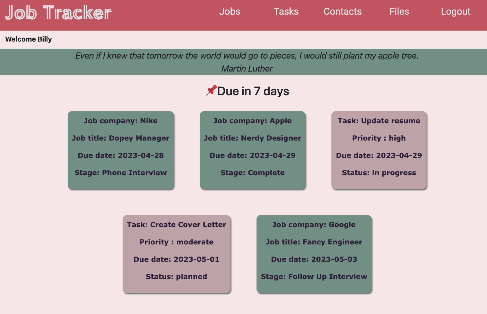

# Project - Job Tracker App 

Full-stack SPA JavaScript Application with CRUD functionality using Node express, fetch API and PostgreSQL.

Group Project submission for [General Assembly](https://generalassemb.ly) Software Engineering Course (end of Unit 3). 

 

#### **Collaborators:**
---
* [Renata Kuroda](https://github.com/RenataKuroda)
* [Xin Yu Zheng](https://github.com/xyzhengg)
* [Yuki Zeng](https://github.com/Yukixx0729)
* [Jeremy Morkos](https://github.com/JeremyMorkos)

 

#### **The technical requirements for this project were:**
---
* Use a NodeJS server that provides a JSON REST API
* Have at least 3 tables in a Postgres database (more if they make sense for the app)
* Allow users to add, modify or organise data for some useful purpose
* Be primarily a single-page-app (multiple HTML pages are fine, but the core of your app should be 1 HTML page)
* Have the browser (client) code interact with the server primarily through a JSON REST API

#### Features:
---
Allow users to sign up if they don't have an account
Allow users to view their pages once logged in
Once logged in, users can see their own their home page a motivational quote and what will be due in the next 7 days. 
Users can navigate through their job board, tasks, contacts, and files. They can add, update, and delete their info.

##### Future implementation:
- Make the app responsive to small screens
- Include option to archive jobs and tasks (other than only deleting)
- Add return button to all pages when adding or deleting something.
- Pre-set colours when adding a job, instead of random colour generation.
- Deploy the app live

### **Planning**
---

1. Choose an idea to work on: A Job Tracker Application to support users to be organised with due dates and tasks, with additional functionality to store files and save contacts for future reference.

2. Define the requirements and plan app functionalities: User authentication, job board, tasks pin board, contacts/agenda, files upload.

3. Group agile environment: Trello.

4. Git Functionalities and individual branches for each new PR.

3. Plan data model:
- Users: This table will store information about the users of the app, such as their name, email address, and password hash.
- Jobs: This table will store information about the jobs, title, description, due date, stage, company name and URL to easily access advertisement.
- To-Dos: This table will store task information as title, due date, priority level and stage. It can also be linked to a specific job. 
- Contacts: This table will store contacts such as their name, phone number, email, company, and any extra info the user finds necessary to have for future reference. 
- Files: This table will store pdf files.

4. Deploy online (pending)

#### **Technologies used**
---
- Node Express
- Back End: JavaScript and PostgreSQL
- Front End: HTML, CSS, Bootstrap and JavaScript

#### **Final Considerations**
---
As a group we have communicated efficiently throughout the project week, so we did not face any major conflicts. All group members have collaborated with great effort and commitment. 
We also learnt how to work on a GitHub environment and to approve and test PR requests. 
Overall, we are very happy as a team with result of our work.

